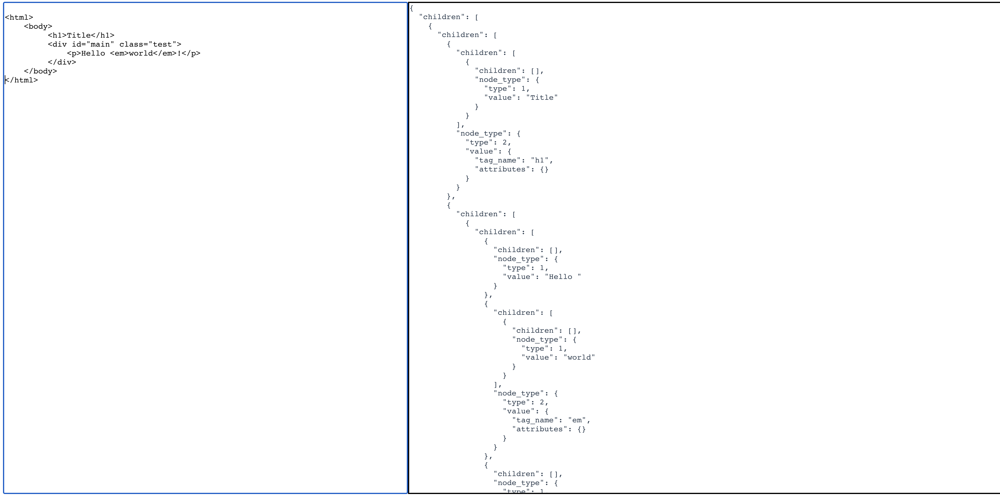

# simple-html-parser
a simple html parser by Typescript

### only 150+ lines, smallest, not complete htmlparser



### Getting Started
Using yarn:
```
yarn && yarn dev
```

inspired by [robinson](https://github.com/mbrubeck/robinson/)